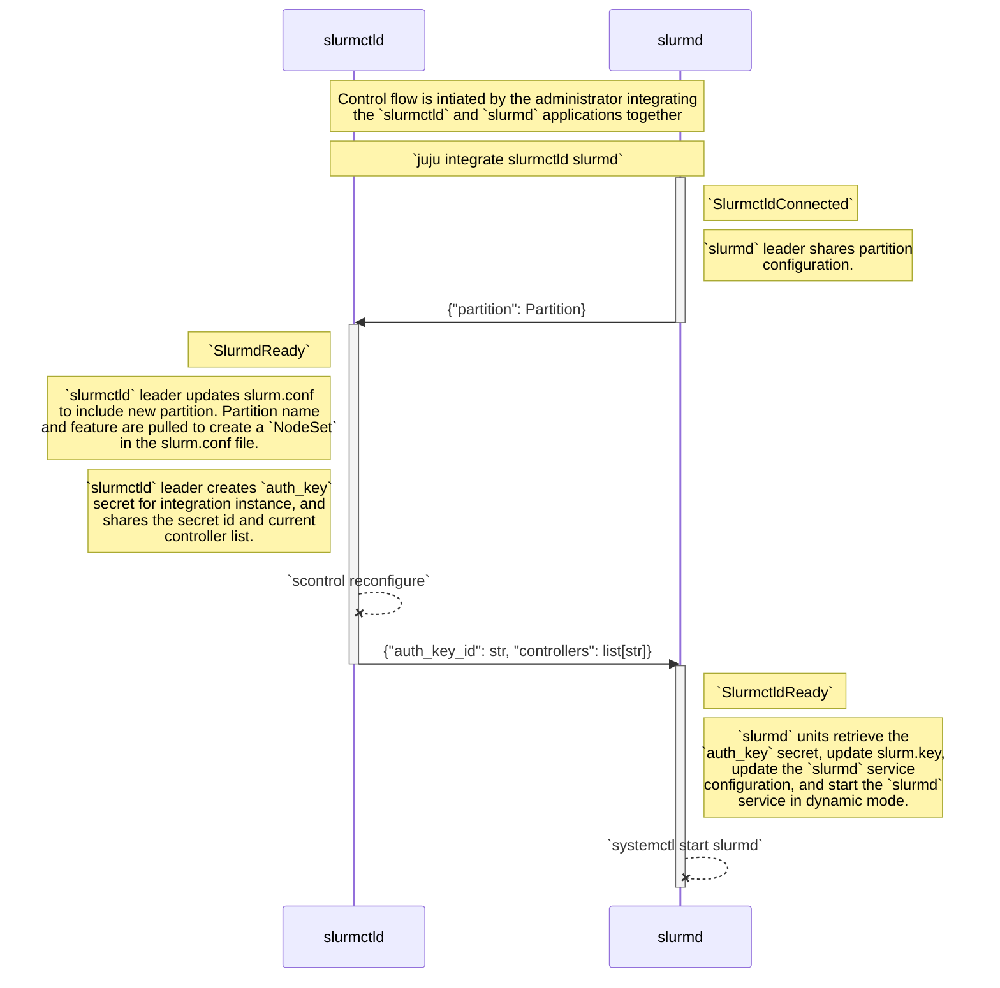
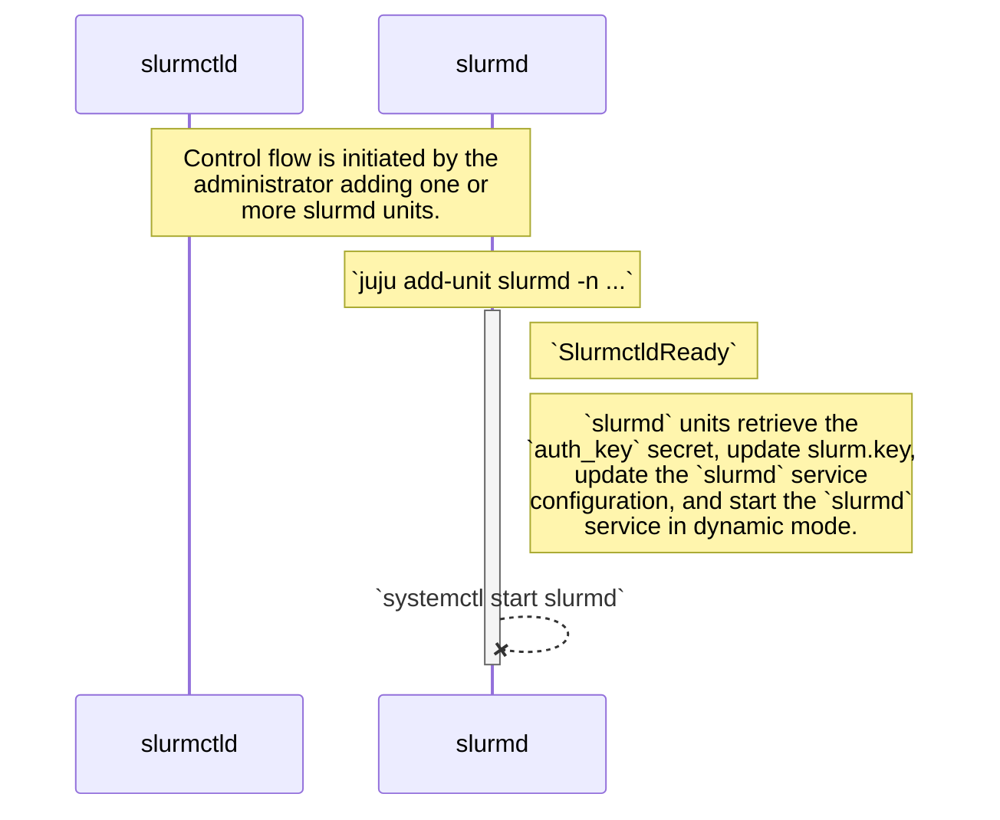
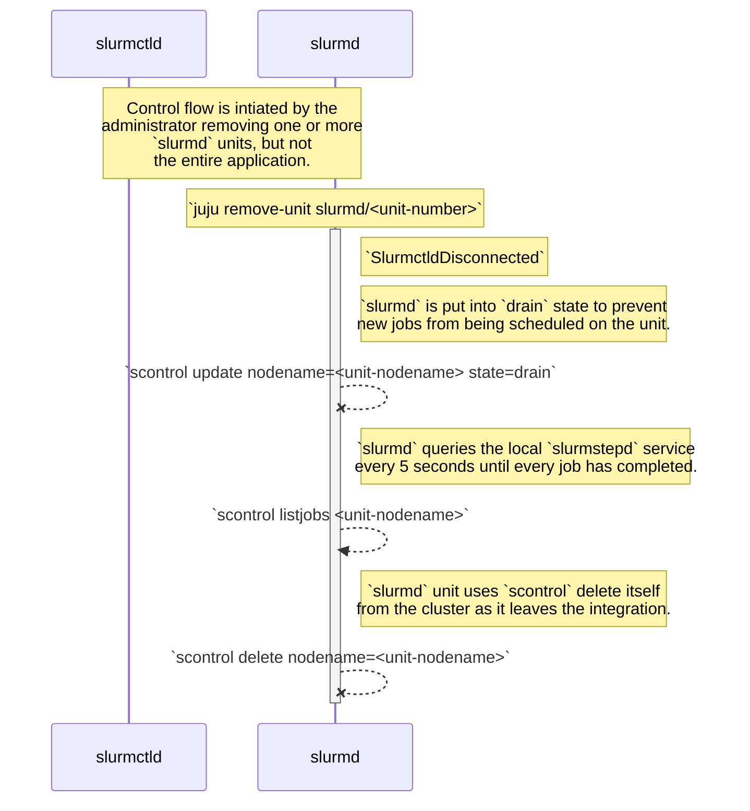
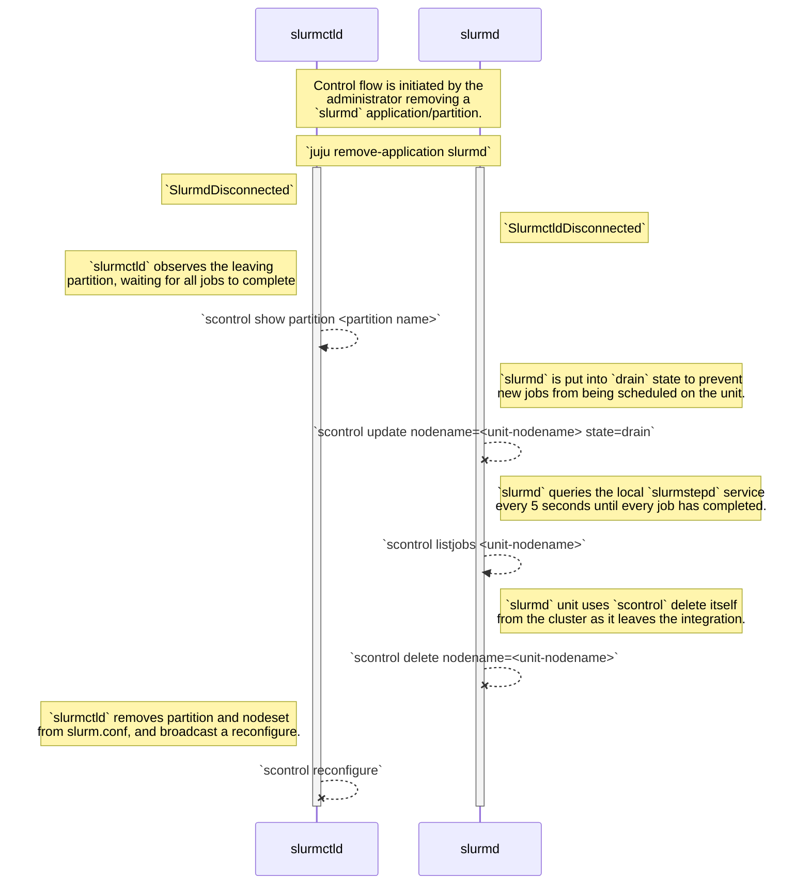

## Abstract

This specification proposes refactoring the Slurm charms to use dynamic compute node enlistment rather traditional compute node enlistment to simplify the cross-integration communication between the `slurmctld` operator and the `slurmd` operator.

## Rationale

As of Slurm 22.05, the Slurm workload manager added support for dynamic nodes. Dynamic nodes are compute nodes that can _dynamically_ be added and removed from an existing Slurm cluster. Newer Slurm deployment solutions such as Slinky use dynamic nodes so that the `slurm-operator` - deployed as part of Slinky - can automatically scale slurmd nodes based on current workload demands. If there are no jobs in the queue, there are no slurmd nodes; if there are jobs in the queue, `slurm-operator` automatically provisions new nodes without making any updates to the _slurm.conf_ configuration file.

Now, if you don't want to use dynamic nodes, you can still configure your Slurm cluster the traditional way by synchronizing the _slurm.conf_ file across the cluster, which is how Charmed HPC does it. However, there are several challenges with this approach that degrade the experience of using Charmed HPC:

1. __Out-of-sync configuration data__

   In the Slurm charms, if you run `juju run slurmctld/leader resume nodename=<slurmd-nodename>`, it will take the target compute node out of the `down` state and place it into the `idle` state. However, this action doesn't update the compute node's information in the integration databag, nor does it update the `DownNodes` entry in the _slurm.conf_ file. What this means is that the next time an event triggers `scontrol reconfigure`, the node will be placed back into the `down` state as the node is still in the `downnodes` field.

2. __Clunky compute node onboarding__ 
 
   On the compute nodes, all the `slurmd` systemd service definitions are wrapped with a custom service override named _service.py_. This service override is required because there's a delay between when the compute node shares its hardware configuration with the controller and when the compute node is inserted into the _slurm.conf_ file, the `slurmd` service cannot immediately start. _service.py_ is used as a workaround for this delay by starting the `slurmd` service with "brute-force" in a background process outside of charm execution; it attempts to start the `slurmd` service over the course of 10 minutes in 30 second intervals, but this degardes the developers' and triagers' experience as `systemctl start slurmd` will hold control of the user's shell for up to 10 minutes. The wrapper script also obscures how the `slurmd` is actually managed by the charm, and the wrapper can make it difficult to debug issues with `slurmd` since there's multiple layers that need to be worked through to actually pinpoint where problems are introduced.

    Using the _service.py_ wrapper also requires the `slurmd` to be converted to a forking daemon &mdash; `Type=forking` &mdash; which is considered a "relic of a bygone age" by `systemd` as this option is only used by traditional services that fork themselves upon start-up. This also creates additional complexity as a PID file is now required to track the `slurmd` service.

3. __Wasted compute node resources__

   Because of point #2, where the `slurmd` service is started in the background outside of charm execution, the `slurmd` operator has no visibility into the current status of the `slurmd` service. While the status of the `slurmd` service can queried within an `_on_update_status` hook, Charmed HPC administrators will likely increase the interval between `UpdateStatusEvent` emissions so more compute resources can be allocated for user workloads.
   
   It's unrealistic to expect that Charmed HPC cluster administrators are willing to wait 5 minutes or longer to know the status of their `slurmd` units, so instead the `slurmd` operator uses the `juju-systemd-notices` daemon to watch the `slurmd` service, and `juju-systemd-notices` will emit a local, per-unit event each time the `slurmd` service starts or stops. However, this approach isn't ideal either as it requires compute node resources to be allocated just to watching the `slurmd` service.
   
4. __Brittle operations and development__

   Since all of the Slurm charm's configuration must pass through the _slurm.conf_ file, developing and operating the `slurmctld` operator is relatively brittle as Slurm's configuration is tightly coupled with Juju integrations. While node configuration can be overwritten using `scontrol` on the `slurmctld` operator, integration data has higher-priority and will overwrite any changes made using `scontrol`. This creates an awkward mismatch between `scontrol` and Juju actions where `scontrol` can be used to manage certain aspects of the Slurm charm's configuration, but Juju actions &mdash; for example `juju run slurmd/<0...n> node-configured` &mdash; are required for other operations such as moving nodes out of the `"down"` state into the `"idle"` state.
   
   Also, since Slurm's configuration is tightly coupled with integration data, this makes it onerus for developers to add new features or modify charm functionality as a change in one interface or event handler requires changes to be made to the rest of the interfaces. This wastes developer time as the developer now needs to spend time solely resolving issues with how configuration data is managed.
   
Switching to using dynamic compute nodes will solve several of these challenges by:

1. Simplifying compute node-specific configuration. Rather than track custom node configuration in an integration databag and then update the corresponding `nodename` entry in _slurm.conf_, the node's custom configuration can be specified using the `--conf` option.
2. Simplifying compute node state management. Rather than rely on `downnodes` and the `node-configured` action to control the state of compute nodes, `scontrol update nodename=...` can be used on either the compute node or the `slurmctld` operator to modify the state, and integration will not overwrite any existing configuration that has been set.
3. Simplifying `slurmd` service start up. Rather than require the _service.py_ wrapper to "brute-force" start the service over the course of ten minutes, the `-Z` option can be provided to slurmd which will instruct `slurmd` to start in dynamic mode rather than expect that its configuration is present within the _slurm.conf_ file.
4. Simplify development and operations. Relying less on integrations and using more of Slurm's built-in capabilities makes it easier for developers and cluster operators to identify where configuration is coming from, and have easier time pinpointing issues as there's less data to parse out of the integrations. It also removes the need for cluster operators to inspect integration data to determine a node's exact configuration.

## Specification

### Control flow for `slurmd` integration with dynamic nodes

#### `slurmd` application is integrated with `slurmctld`



##### Considerations

- Each `slurmd` unit will need the list of currently active `slurmctld` units so that the `slurmd` service knows where to fetch the Slurm configuration files from.
  - The primary controller will need to be the first index in the list of controllers sent to the slurmd units.

#### `slurmd` unit joins integration with `slurmctld`



#### `slurmd` unit departs integration `slurmctld`



##### Considerations

- All jobs currently running on the departing `slurmd` unit must complete before `scontrol` can be used to delete the compute node from the cluster. If `scontrol delete` is called before all jobs on the node have completed, an error will be raised by `scontrol`. 
  - The `slurmd` charm can observe the output of `scontrol listjobs` and block until all jobs have completed on the node before calling `scontrol delete`. However, the downside of waiting for all these jobs to complete within the `slurmd` charm is that the `slurmd` charm will not handle any other events until the Juju machine lock is released.
    - There are mutliple ways to get around this such as calling `event.defer()` until jobs have completed, or starting a background daemon that will fire a local, custom event once the all jobs have completed, but they will need to be investigated in a future specification.
- Until there is proper machinery for waiting for all jobs to complete, a `destroy-jobs/node` action can be used to forcefully drain nodes if a `slurmd` unit must be cleaned up immediately.

#### `slurmd` application departs integration with `slurmctld`



##### Considerations

- `SlurmdDisconnected` must be triggered by a `RelationBroken` event, not a `RelationDeparted` event. `RelationBroken` is triggered as part of the partition teardown process.
- `SlurmctldDisconnected` must triggered by a `RelationDeparted` event. `RelationDeparted` is emitted everytime a unit leaves an integration, and is emitted before `Stop` where the `slurmd` unit would clean itself up.
- The primary `slurmctld` unit cannot block while it waits for a partition to clean itself up. It'll need to be tested if departing compute nodes will be placed into a general queue if a partition is deleted from _slurm.conf_ before all the departing nodes are cleaned up.

### Interface for the `slurmd` integration

Using dynamic nodes will simplify the integration between the `slurmctld` and `slurmd` applications. In this updated interface:

- The `slurmctld` application will be expected to provide:

```python!
@dataclass
class ControllerData:
    auth_key: str
    auth_key_id: str
    controllers: list[str]
```

- The `slurmd` application will be expected to provide:

```python!
from slurmutils import NodeSet, Partition

@dataclass
class ComputeData:
    nodeset: NodeSet
    partition: Partition
```

#### Provider-side (`slurmd`)

For the `slurmd` integration provider-side, the `slurmd` application leader will set the partition configuration. There are two possible pathways for when the partition configuration data must be set:

1. When the `slurmd` application is first connected to the `slurmctld` application.
2. When `juju config slurmd partition-config` is used by the cluster administrator to update the partition configuration:

__For pathway 1__, a default configuration can be provided when `slurmctld` is first connected:

```python!
# Assume `SlurmdCharm` is fully defined.

from slurmutils import Partition, NodeSet

def _on_slurmctld_connected(self, event: SlurmctldConnectedEvent) -> None:
    """Example handler for when `slurmctld` is connected."""
    partition = self._slurmd.set_compute_data(
        ComputeData(
            partition=Partition.from_dict(
                {
                    "partitionname": self.app.name,
                    "nodes": self.app.name,
                    **Partition.from_str(
                        self.config.get("partition-config", "")
                    ).dict(),
                }
            ),
            nodeset=NodeSet(nodeset=self.app.name, feature=self.app.name)
        ),
        integration_id=event.relation.id
    )
```

__For pathway 2__, this functionality is outlined in the [Manage partition-specific configuration information section](#Managing-partition-specific-configuration-information), but essentially in the case where `juju config slurmd ...` is called after, the `_on_config_changed` event handler must call the same code used in the `_on_slurmctld_connected` handler.

#### Requires-side (`slurmctld`)

For the `slurmd` integration requirer-side, the `slurmctld` application leader will use partition data provided by the `slurmd` application leader to update the _slurm.conf_ file:

```python!
# Assume `SlurmctldCharm` is fully defined.

@reconfigure  # Run `scontrol reconfigure` if `slurmctld` is active.
def _on_slurmd_ready(self, event: SlurmdReadyEvent):
    """Example handler for adding a new/updating a partition."""
    data = self._slurmd.get_compute_data(event.relation.id):

    with self._slurmctld.config.edit() as config:
        config.partitions[data.partition.partition_name] = data.partition
        config.nodesets[data.nodeset.nodeset] = data.nodeset
```

Rather than explicitly declare the compute nodes in the _slurm.conf_ file, nodes will now instead be associated with a node set instead, where the nodeset, feature, and partition name map to the `slurmd` application name:

```text!
# Assume `slurmctld` configuration is fully defined.

nodeset=<partition name> feature=<partition name>

partitionname=<partition name> nodes=<partition name>
```

### Starting the `slurmd` service in dynamic mode

The `-Z` flag can be used to start the `slurmd` service in dynamic mode. The `--conf` flag must be used to override the detected configuration of the unit.

Example code:

```python!
# Assume `SlurmdCharm` is fully defined.

@refresh  # If `slurmd` starts successfully, set `ActiveStatus()`.
def _on_slurmctld_ready(self, event: SlurmctldReadyEvent) -> None:
    """Example handler for after `slurmctld` has shared info."""
    data = self._slurmctld.get_controller_data(event.relation.id)
  
    self._slurmd.key.set(data.auth_key)
    self._slurmd.config_servers = data.controllers
  
    # Merge the node's auto-detected config with the admin supplied config.
    self._slurmd.config = (
        self._slurmd.machine_info() | self._user_supplied_params
    ).add(f"feature={self.app.name}")
  
    try:
        self._slurmd.service.start()
    except SlurmOpsError as e:
        logger.error(e.message)
        raise StopCharm("debug plz")
```

##### Considerations

- The `SlurmdManager` class from `hpc_libs` must be updated to support new environment variables for setting both the controller list and custom configuration.
  - Currently, the `slurmd` service uses a custom override for determinig if the `--conf-server` flag should be added to the `slurmd` start up arguments, but this isn't ideal as introduces an additional layer of complexity to starting `slurmd`. A string template should possibly be used instead to conditionally render `SLURMD_OPTIONS` since _/etc/default/slurmd_ is not executable; it can only be read.
- `-Z` must become a default start up argument in _/etc/systemd/system/slurmd.service_.

### Managing compute node-specific configuration

The `slurmd` operator currently has a `node-config` action for cluster administrators who must provide configuration not supported by the `slurmd` operators. `ops.StoredState` can be used to persist the custom configuration the administrator has set, but the `--conf` option should be the "source-of-truth" for viewing a node's current configuration.

There are three possible pathways for when a node's configuration is modified:

1. Before the `slurmd` service starts after receiving a `SlurmctldReady` event.
2. After `slurmd` service starts, but `slurmctld` has updated integration data such as cycling out a key or updating the controller list.
3. After the `slurmd` service has started, and the administrator runs the `node-config`.

__For pathways 1 and 2__, this can be handled by the example `_on_slurmctld_ready` handler. `SlurmctldReady` will be emitted each time a `RelationChanged` event occurs, and the integration has both the `auth_key_id` and `controllers` field set.

__For pathway 3__, additional logic must be implemented in the `_on_node_config_action`. A `reconfigure` decorator can be used to signal that the running `slurmd` service must be reconfigured and restarted:

```python!
from collections.abc import Callable
from functools import wraps


def reconfigure(func: Callable[..., None]):
    @wraps
    def wrapper(charm: SlurmdCharm, *args: ops.EventBase, **kwargs):
        if charm.slurmd.service.active()
            charm.unit.status = ops.MaintenanceStatus("reconfiguring")
            # Merge updated config with existing.
            charm.slurmd.config = (
                charm.slurmd.machine_info() | charm.custom_slurmd_config
            )
            charm.slurmd.service.restart()
            
    return wrapper
        

# Assume `SlurmdCharm` is fully defined.
# Wrap `reconfigure` with `refresh` to catch `StopCharm` errors. 
@refresh
@reconfigure
def _on_node_config_action(self, event: ops.ActionEvent) -> None:
    """Modified `node-config` handler."""
    
    # Use `slurmutils.models.slurm.Node` to lint custom configuration.
    self.custom_node_config = config.dict()
    # `reconfigure` handles updating and restarting `slurmd` service.
```

### Managing partition-specific configuration information

The current mechanism for managing partition configuration will largely remain the same, but will use an updated `slurmd` interface implementation. There are two possible pathways for when a partition's configuration is modified:

1. When the `slurmd` application is first integrated with `slurmctld`.
2. After the `slurmd` application is integrated with `slurmctld`, and the cluster administrator has updated partition configuration using `juju config slurmd partition-config="..."`


__For pathway 1__, a `_on_slurmctld_connected` event handler can be used to set the partition configuration for `slurmctld`:

```python!
# Assume `SlurmdCharm` is fully defined.

def _on_slurmctld_connected(self, _: SlurmctldConnectedEvent) -> None:
    """Example handler for when `slurmctld` is first integrated."""
    self._slurmctld.set_compute_data(self.custom_partition_config)
```


__For pathway 2__, minimal changes are required to be made to the `_on_config_changed` event handler:

```python!
# Assume `SlurmdCharm` is fully defined.

def _on_config_changed(self, _: ConfigChangedEvent) -> None:
    """Modified `ConfigChanged` event handler."""
    if self.unit.is_leader()
        try:
            config = Partition.from_str(
                self.config.get("partition-config")
            )
            if self._slurmctld.joined():
                self._slurmd.set_compute_data(
                    ComputeData(
                        partition=Partition.from_dict(
                            {
                                "partitionname": self.app.name,
                                "nodes": self.app.name,
                                **config.dict()
                            }
                        ),
                        nodeset=NodeSet(
                            nodeset=self.app.name, 
                            feature=self.app.name,
                        )
                    ),
                )
        except (ValueError, ModelError) as e:
            ...
            
    # Leave `NHC` configuration untouched.
```

##### Considerations

- Only the partition leader can set the partition configuration that will be used by the `slurmctld` application leader.
- The `reconfigure` decorater could be used to handle generic reconfigurations &mdash; e.g. both unit-level and application-level configuration changes &mdash; but additional logic would be required within the decorator body to separate leader and non-leader logic.

### Generic Resource (Gres) scheduling

The mechanism for provisioning detected resources will remain the same, but the `slurmd` application will no longer provide Gres data in the integration databag. Instead, the `Gres` field will be included as part of the `--conf` flag.

##### Considerations

- Additional testing will be required as the integration tests do not currently test GPU-equipped instances. `charmed-hpc-benchmarks` must be used instead.

### Expected work

Expected work items include:

1. Updating `SlurmdManager` in `hpc_libs` to support multiple controllers endpoints.
2. Updating `SlurmdManager` in `hpc_libs` to support modifying the `--conf` flag.
3. Updating `systemd` service override for the `slurmd` service to include the `-Z` flag.
4. Adding a `slurmd` interface implementation to `hpc_libs`.
5. Integrating the new `slurmd` interface implementation into the `slurmd` and `slurmctld` operators.
6. Updating the relevant integration and unit tests.
7. Tests new dynamic node implementation on AWS/Azure to ensure that Gres accounting works successfully.

### Risks

1. Since the `slurm-charms` monorepo uses `uv` workspaces for dependency management, the `slurmrestd` and `slurmdbd` operators may need to be uppdated to use the the new `slurmutils` v1 API to satisfy dependency resolution requirements.
2. Currently, Charmed HPC doesn't handle draining nodes when a `slurmd` unit or application is removed, but it will need to for `scontrol delete ...` to work successfully. 

   The charms themselves can observe the output of `scontrol listjobs/show` to wait for all the resources to clean themselves up, but the Juju machine lock will prevent the charms from processing any other events. This can be especially costly for partitions that still have many jobs running on them, and extra care will be required by the cluster administrator to ensure that all the `slurmd` units are drained before removing the `slurmd` application.
   
   Possibly this won't be an issue as the `slurmd` units should handle all `RelationDeparted` events before `RelationBroken` is emitted, but extra care will be required to ensure that the `slurmctld` operator isn't blocked for extended periods of time while cleaning up compute resources.

### Future work

- The `juju-systemd-notices` service will no longer be required once the `slurmd` service starts in dynamic mode, for the `slurmd` service will not require updates to be made to the _slurm.conf_ file on the primary controller unit before starting. However, there are still benefits to having a service watch the health of the `slurmd` service.

## Further Information

1. [Slurm dynamic nodes documentation](https://slurm.schedmd.com/dynamic_nodes.html)
2. [Charmed HPC benchmarks repository](https://github.com/charmed-hpc/charmed-hpc-benchmarks)

## Spec History and Changelog

| Date            | Status       | Author(s)           | Comment                                                                                                                       |
| --------------- | ------------ | ------------------- | ----------------------------------------------------------------------------------------------------------------------------- |
| June 18th, 2025 | Drafting     | Jason C. Nucciarone | Initial draft                                                                                                                 |
| June 18th, 2025 | Needs review | Jason C. Nucciarone | Initial draft completed                                                                                                       |
| June 20th, 2025 | Needs review | James Beedy         | Made comments on using `event.app.name` for the partition name, and proposed adding an action for "brute-force" node draining |
