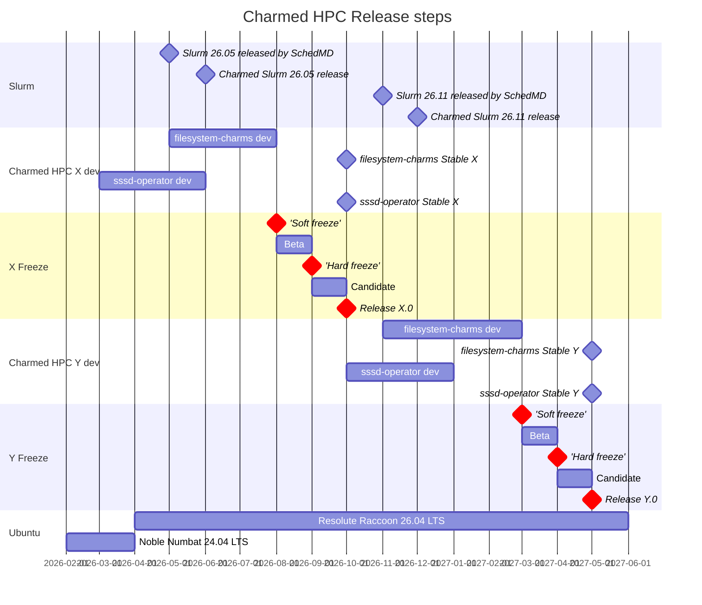

# Release policy for Charmed HPC

## Abstract

This spec defines the release policy for Charmed HPC, a portfolio of charms and supporting artifacts.

The policy covers the versioning scheme (`<major release>.<patch version #>`), the release cadence and how it relates to the per-component cadences defined in their own specs, the Charmhub channels and GitHub branches used for each constituent charm, the soft-freeze / hard-freeze / release-day progression, the support life-cycle for each Charmed HPC release, and the format and sections of the published release notes. A companion [Release Notes Template](release-notes-template.md) accompanies this spec.

## Rationale

A consistent release policy is necessary to keep our community aware of upcoming major changes, bug fixes, and security updates, while ensuring that the community has some expected degree of stability.

Charmed HPC is a composition of multiple charms and supporting artifacts. Some constituent component (e.g. Charmed Slurm) follows its own upstream-driven release cadence and has its own spec. There must, however, be a well-defined, Charmed-HPC-wide release policy that developers and users can reference to know:

* When new features, bug fixes, and security updates can be expected across the set of charms.
* Which charm versions have been verified to work together as a single Charmed HPC release.
* What compatibility guarantees apply to a `Stable` channel (no breaking changes to integrations, configuration options, or actions).
* How the release progresses from soft freeze, to Beta, to Candidate, to Stable.
* How long a given Charmed HPC release is supported, and what "end of support" means.
* What information is published in release notes, and in what format.

Without such a policy, users cannot reliably schedule upgrades, security patching, or feature adoption across a Charmed HPC deployment, and the maintainers lack a shared reference for release planning, freeze dates, and channel promotion criteria.

## Specification

## Artifacts

Charmed HPC artifacts:

<!-- Update this list as the Charmed HPC portfolio evolves -->

- Charmed Slurm (see [UHPC 003](../UHPC%20003%20-%20Release%20policy%20and%20notes%20for%20Charmed%20Slurm/uhpc-003.md))
- filesystem-charms:
  - cephfs-server-proxy
  - filesystem-client
  - lustre-server-proxy
  - nfs-server-proxy
  - test-mount-client
- lustre-server
- sssd-operator

> **[DECISION NEEDED]** Are underlying dependencies that are not charms listed with the artifacts in the release notes (i.e. `charmed-hpc-libs`)?

### Versioning scheme

Version format: `<major release>.<patch version #>`. Example Charmed HPC release numbers:

- Initial release: "1.0"
- Bugfix release: "1.1"
- Security update: "1.2"

* Major release - new features, new Ubuntu base version, updated artifact versions
* Minor release - bug and security fixes only
  * Note that running `juju refresh` is necessary to pull the latest security and bug fix updates

> **[DECISION NEEDED]** Clarify whether bugfix and security releases both bump the same patch digit, or if they are distinct version components.

## Release cadence

> **[DECISION NEEDED]** What is the target cadence for Charmed HPC releases? (e.g., aligned with Ubuntu LTS, twice yearly, ad-hoc?) What are the cadences for bug and security releases?

Individual components within Charmed HPC (e.g. Charmed Slurm) may follow their own upstream-driven release cadences as defined in their respective specs. Since Charmed HPC is a set of charms rather than a single deployable artifact, a Charmed HPC release defines a tested, compatible set of charm versions that are verified to work together.

> **[DECISION NEEDED]** Is each Charmed HPC major release tied to a specific Ubuntu LTS? Can a user run a given Charmed HPC release on multiple Ubuntu bases (e.g., both 24.04 and 26.04)?

### Release channels and branches

Since Charmed HPC is a set of charms rather than a single charm, release channels apply to each constituent charm individually.

* Each track has a corresponding GitHub branch
* Each track on Charmhub provides four channels:
   * Edge, the development channel
   * Beta
   * Candidate, to test the new release before publishing
   * Stable
     * No breaking changes will be made to integrations, configuration options, or actions in a stable channel of a charm

### Release cycle and feature freezes

A Charmed HPC release progresses through three phases between freezes:

* **Soft freeze** — all new feature work stops. Each charm is published to its **Beta** channel, where candidadate-level testing is performed.
* **Hard freeze** — each charm is promoted from Beta to **Candidate**, where stable-level testing is performed.
* **Release day** — all charms are promoted from Candidate to **Stable**.

Given the variety of charms, the Candidate/Stable for a given charm may be the same as for the prior release. Freeze dates are set during cycle planning.

> **[DECISION NEEDED]** Define the gating criteria for channel promotions (e.g., required test suites, manual QA sign-off, automated gates). Who sets freeze dates and how far in advance are they announced?

## Support life-cycle

> **[DECISION NEEDED]** How long is bug and security fix support provided for each Charmed HPC release? (e.g., 12 months, 18 months, tied to Ubuntu LTS?) For reference, UHPC-003 commits to 1 year following upstream Slurm.

> **[DECISION NEEDED]** Does support include only the latest patch release, or are older patches also supported? Are out-of-band security updates provided? What does "end of support" mean (no more bugfixes, no more security fixes, charms removed from Charmhub)?

> **[DECISION NEEDED]** Components that track upstream projects (e.g. Charmed Slurm tracking SchedMD's Slurm) have their own support life-cycles. If Charmed Slurm supports for X years but Charmed HPC supports for Y years, which policy takes precedence?

## Documentation

Warnings/limitations that will be included in the published documentation alongside the release notes:

* Due to potential breaking changes between major releases, Charmed HPC cannot guarantee backwards compatibility with previous major versions
  * If a user requirement necessitates artifact versions that are not from a single release, they should open an issue on GitHub (or Discourse) and work with the team

#### Release Notes Template

See the [Release Notes Template](release-notes-template.md) for the template used when drafting a new release's notes.

## Release notes sections

General release notes sections for Charmed HPC:

* Release summary
* Artifacts and versions included in the release
* What's new (features and improvements)
* Requirements and compatibility (Ubuntu base, Juju version, Charmhub tracks)
* Backwards incompatible changes
* Deprecated features
* Known issues
* Upgrade notes (including `juju refresh` instructions)
**[DECISION NEEDED]** Define supported upgrade paths (e.g., 1.0 → 1.1, 1.0 → 2.0). Is skipping major versions supported? Are downgrades supported?
* Support lifecycle

## References

* [UHPC 003 - Release policy for Charmed Slurm](../UHPC%20003%20-%20Release%20policy%20and%20notes%20for%20Charmed%20Slurm/uhpc-003.md)
* [Canonical product release cycles](https://ubuntu.com/about/release-cycle#ubuntu)
