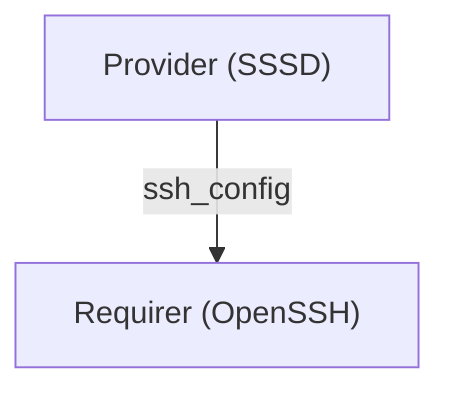

# OpenSSH operator

## Abstract

This specification proposes the initial implementation of an `openssh` charm operator for facilitating 
remote SSH connections to login and compute nodes in Charmed HPC clusters. This specification also
outlines how the `openssh` operator will gain access to the public SSH keys of remote users stored
in an external LDAP server.

## Rationale

There is currently no straightforward way in Charmed HPC to easily configure remote access for users
whose credentials are stored in an external directory service like OpenLDAP. The current approach
used for logging in as remote users in demos is to first SSH into the target `sackd` unit as the `ubuntu`
user with `juju ssh ...`, and then log in as the target user with `sudo -u <username> -i`. The `sssd` 
subordinate unit integrated with the `sackd` unit provides access to LDAP server. While 
this approach works for proof-of-concept demos that demonstrate new features in Charmed HPC, this approach is not 
representative of how users will actually log into production systems at their HPC site; they will not
have access to `sudo` nor the `ubuntu` user. This issue brings to light the following dilemma: while there are 
charms for both `sackd` and `sssd`, there is no charm that effectively coordinates these two charms to provide
a seamless login experience for Charmed HPC cluster users.

To address the lack of a seamless login experience for users, specification UHPC 013 proposes several 
approaches for effectively coordinating the `sackd` and `sssd` charms to function together as a 
traditional HPC cluster login node. After analyzing the findings of UHPC 013, it was identified that to enable 
SSH-based authentication with the `sackd` and `sssd` charms, an `openssh` charm must be created so that 
the OpenSSH server can query the LDAP server to retrieve users' public SSH keys.

## Specification

The `openssh` charm will be a subordinate charm that is typically deployed alongside a `sssd` charm
on a principal charm like `sackd`. `openssh` and `sssd` will work in tandem to provide SSH-based authentication
to remote users that exist in either an external LDAP server or a charmed LDAP server like Authentik.

#### Terminology

The terms `openssh` and `sshd` are used interchangeable when referring to the SSH service that the `openssh`
charm manages. `sshd` is the generic name a machine's SSH service is referred to as when performing
common operations with systemctl, and `openssh` provides Ubuntu's implementation of the `sshd` service.

### Supported versions

The `openssh` charm will manage and operate the `openssh-server` package provided in Ubuntu's `main` archive.
The charm's only supported base will be Ubuntu 26.04, and will use Python 3.14 as its runtime.

The latest version of `ops` should be used, and only `pydantic` v2 should be used for custom data models.

### Structure of the `openssh` charm

The initial structure of the `openssh` charm will be the following:

```text
.
├── src
│   ├── charm.py
│   ├── config.py
│   ├── constants.py    
│   ├── openssh.py
│   ├── integrations
│   │   ├── __init__.py
│   │   └── ssh_config.py
│   └── operations
│       ├── __init__.py
│       └── lifecycle.py
└── pkg
    └── ssh-config
```

- _charm.py_ - Main entrypoint of the `openssh` charm. This module contains the primary `OpenSSHCharm` class that
  is passed to the `ops.main` entrypoint function.
- _config.py_ - Manage the charm's application configuration. _openssh.py_ manages the underlying 
  workload's configuration whereas _config.py_ manages the charm's configuration.
- _constants.py_ - Constant values used in the `openssh` charm such as integration names.
- _openssh.py_ - Manages the `openssh` workload lifecycle (`sshd` service) on the machine.
- _integrations_ - Integration observers implemented according to specification UHPC 010.
  - *ssh_config.py* - `ssh-config` integration observer. Observes events related to the `ssh-config` interface. 
- _operations_ - Operations observers implemented according to specification UHPC 010.
  - _lifecycle.py_ - Lifecycle operations observer. Observes charm lifecycle events such as `install` and `stop`.
- _pkg_ - external interface packages published to PyPI in accordance with specification UHPC 009.
  - _ssh-config_ - `ssh-config` integration interface implementation package. Consumed
    by charms that need to provide OpenSSH server configuration to the `openssh` charm. This directory is
    also an uv workspace that has separate _pyproject.toml_ file.

### Lifecycle operations

The `openssh` charm's entrypoint will be the _charm.py_ file. `OpenSSHCharm` will be defined in this file:

```python
# In `charm.py`
import ops

from config import OpenSSHConfigManager
from integrations import SSHConfigObserver
from operations import LifecycleObserver
from openssh import OpenSSHManager


class OpenSSHCharm(ops.CharmBase):
    """Charmed operator for the ``openssh``/``sshd`` service."""

    def __init__(self, framework: ops.Framework) -> None:
        super().__init__(framework)
        
        self.openssh = OpenSSHManager()
        try:
            self.app_config = self.load_config(OpenSSHConfigManager)
        except ValidationError as e:
            logger.error(e)
            self.unit.status = ops.BlockedStatus(
                "Configuration option(s) "
                + ", ".join(
                    [
                        f"'{option.replace('_', '-')}'"  # type: ignore
                        for error in e.errors()
                        for option in error.get("loc", ())
                    ]
                )
                + " failed validation. See `juju debug-log` for details"
            )
            return
                
        self.lifecycle = LifecycleObserver(self)
        self.ssh_config = SSHConfigObserver(self)


if __name__ == "__main__":  # pragma: nocover
    ops.main(OpenSSHCharm)
```

The pseudocode above outlines the structure of the _charm.py_ file. Key observations are:

1. All integration and charm event handlers must be defined in observers, not in the main _charm.py_ file.
2. The `load_config` method should be used to load the `openssh` charm's configuration, and a `BlockedStatus`
   message should be set for the unit.
3. All `openssh` service management methods should be defined in `OpenSSHManager`.

### Managing the `openssh` service

The `openssh`/`sshd` service will be managed and driven by an `OpenSSHManager` class defined 
in _lifecycle.py_. The class will inherit from the proposed `AptLifecycleManager` manager class 
in `charmed-hpc-libs`:

```python
# In `openssh.py`
from functools import cached_property
from pathlib import Path

from charmed_hpc_libs.ops import AptLifeycleManager, SystemctlServiceManager


class OpenSSHConfigManager:
    """Manage the configuration of the ``openssh``/``sshd`` service."""
  
    def __init__(self) -> None:
        self._etc_path = Path("/etc/sshd")
        self._config_path = self._etc_path / "ssh_config.d"
        
    def write(self, filename: str, content: str) -> None: ...
    """Write out a new SSH configuration file in `/etc/ssh/ssh_config.d`"""
    
    def validate(self) -> None: ...
    """Validate the ``openssh``/``sshd`` server configuration with ``sshd -t``.
    
    A custom ``InvalidConfigError`` should be raised if ``sshd -t`` returns a non-zero exit code.
    If an ``InvalidConfigError`` is emitted, then the ``ssh-config`` integration observer
    should set a blocked status on the charm using the ``StopCharm`` exception and the ``refresh``
    decorator from ``charmed-hpc-libs``.
    """
    
    def remove(self, filename: str): ...
    """Remove SSH configuration file from ``/etc/ssh/ssh_config.d``."""


class OpenSSHManager(AptLifecycleManager):
    """Manage the ``openssh``/``sshd`` operations on a machine."""
    
    def __init__(self) -> None:
        super().__init__("openssh-server")

    @cached_property
    def config(self) -> OpenSSHConfigManager:
        return OpenSSHConfigManager()
    
    @property
    def log_level(self) -> str: ...
    """Get the log level of the ``openssh``/``sshd`` service."""
    
    @log_level.setter
    def log_level(self, value: Literal[...]) -> str: ...
    """Set the log level of the ``openssh``/``sshd`` service."""
    
    @property
    def port(self) -> int: ...
    """Get the port number the ``openssh``/``sshd`` service communicates on."""
    
    @port.setter
    def port(self, value: int) -> None: ...
    """Set the port number the ``openssh``/``sshd`` service communicates on."""

    @port.deleter
    def port(self) -> None: ...
    """Unset the port number the ``openssh``/``sshd`` service communicates on."""

    @cached_property
    def service(self) -> SystemctlServiceManager:
        return self._ops_manager.service_manager_for("sshd")
```

The `OpenSSHConfigManager` class will be responsible for interfacing with the configuration files
in the *ssh_config.d* directory. The custom SSH configuration files will use the following naming scheme:

```text
/etc/ssh/ssh_config.d/<integration-name>-<integration-id-number>-<remote-app-name>.conf
```

The metadata `integration-name`, `integration-id-number`, and `remote-app-name` will be used
to associate:

1. Which integration endpoint the custom SSH configuration was pulled from.
2. Which instance of the integration endpoint the custom SSH configuration was pulled from.
3. And, the application that requested this custom SSH configuration to be set.

These custom SSH configuration files will be removed when either its associated integration instance
departs the integration, the integration with the remote application is broken, or if the `openssh`
is removed with `juju remove-application`. The `openssh` service will be reloaded each time there is a
modification to the _/etc/ssh/ssh_config.d_ directory.

#### Modifying the `openssh`/`sshd` service logging level

Mutating the `log_level` property will update the logging level of the running `openssh`/`sshd`
service on the Juju machine where the `openssh` operator is deployed. The acceptable values for
this configuration options will map to the logging levels specified in the `ssh_config` manual page.
The logging level will be configured in the _log-level.conf_ file in *etc/ssh/ssh_config.d*:

```python
# In `lifecycle.py`
import ops


class LifecycleObserver(ops.Object):
    """Observe charm lifecycle events."""

    # Assume `LifecycleObserver` is fully defined.
    def _on_config_changed(self, _: ops.ConfigChangedEvent) -> None:
        self.charm.openssh.log_level = self.charm.app_config.log_level
        
        # Additional configuration steps.
        
        self.charm.openssh.service.reload()

```

It will not be possible to delete the configured logging level as the `openssh`/`sshd` 
server should have an explicit logging level set.

#### Modifying the `openssh`/`sshd` service port number

Mutating the `port` property will update the port number that the `openssh`/`sshd` service 
communicates over. By default, the SSH port number is set to `22`, but certain cluster admins
may want to change this to a different, non-standard port. When a new port number is set,
a new _port-override.conf_ configuration file will be created under *etc/ssh/ssh_config.d*:

```python
# In `lifecycle.py`
import ops


class LifecycleObserver(ops.Object):
    """Observe charm lifecycle events."""

    # Assume `LifecycleObserver` is fully defined.
    def _on_config_changed(self, _: ops.ConfigChangedEvent) -> None:
        if self.charm.app_config.port == 22 and self.charm.openssh.port is not None:
            del self.charm.openssh.port
        else:
            self.charm.openssh.port = self.charm.app_config.port
            
        self.charm.expose(self.charm.app_config.port)
        
        # Additional configurations steps.
            
        self.charm.openssh.service.reload()
```

The _port-override.conf_ configuration file should be deleted if the custom port number is set 
back to the default port number `22`.

#### Risks

An inherent risk with using the `openssh` operator to manage the `openssh`/`sshd` service is that the
machine will more than likely already have a running `openssh`/`sshd` service that was provisioned
by Juju. Because the `openssh`/`sshd` service already exists and is required by the `juju ssh ...`
command, the `openssh` operator must not stop or uninstall the `openssh` service when the operator
is removed with `juju remove-application`. The installation operations should also only ensure that
the `openssh-server` package is available, and only install the package if it is not present.

When the `openssh` application is removed from a Juju model, the operator should only remove the
custom configuration files it created, and reload the `openssh`/`sshd` service's configuration:

```python
# In `lifecycle.py`
import ops


class LifecycleObserver(ops.Object):
    """Observe charm lifecycle events."""

    # Assume `LifecycleObserver` is fully defined.
    def _on_remove(self, _: ops.RemoveEvent) -> None:
        for config in ...:  # ... -> Files under `/etc/ssh/ssh_config.d`
            self.charm.openssh.config.remove(config)
```

### Managing the `openssh` charm's application configuration

A `pydantic` dataclass will be used to intercept and validate the `log_level` and `port` configuration options:

```python
# In `config.py`
from typing import Annotated, Literal

from pydantic import Field
from pydantic.dataclasses import dataclass


@dataclass(frozen=True)
class CharmConfigManager:
    """Manage a charmed `openssh` application's configuration options."""
    
    port: Literal[22] | Annotated[int, Field(ge=1024, le=65535)]
    log_level: Literal["quiet", "fatal", "error", "info", "verbose", "debug", "debug1", "debug2", "debug3"]
```

A custom field validator should log a warning message if the `openssh` application's log level is set
to either `debug`, `debug1`, `debug2`, or `debug3`. The message should state that these logging levels
should not be used in production, and they can potentially emit sensitive user data.

The default value for the `port` configuration option should be `22`. The default value for the `log_level`
configuration option should be `info`. Both these defaults should be set in the _charmcraft.yaml_ file
and not directly in the dataclass.

> [!NOTE]
> 
> This charm configuration management pattern is adapted from the `slurmctld` and `slurmdbd` charms.

### Integrations

#### `juju-info`

The `juju-info` integration will be the integration that is used to integrate the `openssh` charm
with a principle charm.

```yaml
# Assume `charmcraft.yaml` is fully defined.

requires:
  juju-info:
    interface: juju-info
    scope: container
```

#### `ssh-config`

The `ssh-config` integration will be vendored as publishable `uv` workspace under the `pkg/` directory
in the `openssh` charm. The integration will enable applications such as SSSD to provide custom SSH
configuration to OpenSSH. It is expected that requirers - for example, SSSD - will provide the `openssh`
charm the configuration necessary for SSSD to successfully interoperate with the `openssh`/`sshd` service
on the machine. The interface name itself will be `ssh_config`.

```yaml
# Assume `charmcraft.yaml` is fully defined.

provides:
  ssh-config:
    interface: ssh_config
```

##### Direction

The provider should _provide_ SSH configuration through the integration data bag; the requirer
should not provide any data in return. Only the leader of the provider application should provide
the custom SSH configuration in the integration's application databag. All requirers (all `openssh` units)
should react to the provider updating the application databag.



##### Implementation

The `SSHConfigProvider` and `SSHConfigRequirer` classes should inherit from the `Interface` base class
provided by `charmed-hpc-libs`. The `ssh-config` integration interface implementation should also
provide a simple `pydantic` dataclass for accessing the custom SSH configuration provided by the Provider:

```python
# In `ssh-config-interface/src/ssh_config_interface/__init__.py`
import ops
from charmed_hpc_libs.interfaces import Interface
from charmed_hpc_libs.ops import leader
from pydantic.dataclasses import dataclass


@dataclass(frozen=True)
class SSHConfigData:
    """Data provided by the ``ssh-config`` integration provider.
    
    Attributes:
        ssh_config: Custom configuration to place under ``/etc/ssh/ssh_config`` on the requirer.
    """

    ssh_config: str
    

class SSHConfigProvider(Interface):
    """Integration interface implementation for ``ssh-config`` providers."""
 
    @leader
    def _on_relation_created(self, event: ops.RelationCreatedEvent) -> None: ...
    """Emit an ``SSHConfigRequirerConnectedEvent`` when integration is created."""
    
    @leader
    def set_config_data(self, data: SSHConfigData, /, integration_id: int | None = None) -> None: ...
    """Set custom SSH configuration data in the application databag."""
    
    
class SSHConfigRequirer(Interface):
    """Integration interface implementation for ``ssh-config`` requirers."""

    def _on_relation_changed(self, event: ops.RelationChangedEvent) -> None:
        """Emit an ``SSHConfigProviderReadyEvent`` provides SSH configuration data."""
        if not event.relation.data.get(event.app):
            return
    
        self.on.ssh_config_provider_ready.emit(event.relation)
        
    def _on_relation_broken(self, event: ops.RelationBrokenEvent) -> None: ...
    """Emit an ``SSHConfigProviderDisconnected`` event when the provider application is removed."""        

    def get_config_data(self, integration_id: int | None = None) -> SSHConfigData: ...
    """Get custom SSH configuration data from event application databag."""
```

> [!WARNING]
>
> Extensively validating and sanitizing the data provided through the `ssh_config` integration
> is out-of-scope for the initial implementation of the `charmed-openssh-ssh-config-interface`
> package.

> [!NOTE]
>
> The implementation of this integration interface implementation package will be
> similar to the `charmed-slurm-oci-runtime-interface` package.


##### Publishing

The reusable `publish-monorepo-python-packages` workflow will be used to automate publish the
`ssh-config-interface` subpackage on PyPI. The package should be published under the name 
`charmed-openssh-ssh-config-interface` to prevent collisions with existing packages on PyPI.

A `PYPI_PUBLISH_TOKEN` will be added as a secret to the `openssh` charm repository on GitHub
so that the release pipeline can automatically publish the packages.

### Testing

`ops.testing` will be used to draft the unit tests for the `openssh` operator. `gherkinator` and 
`pytest-jubilant-bdd` will be used to draft the `openssh` charm's integration tests. The
`sssd-operator` provides an example implementation of using `gherkinator` and `pytest-jubilant-bdd`
together to write integration tests for charms.

### Terraform

The `openssh` charm will provide a CC008-compliant Terraform module so that operator can be deployed with
Terraform and not only the Juju CLI. The `sssd-operator` provides an example of a CC008-compliant
Terraform module for a subordinate charm.

## Further information

### Relevant links

1. [OpenSSH website](https://www.openssh.org)
2. [UHPC 013 pull request and discussion](https://github.com/canonical/hpc-specs/pull/18)
3. [Specification UHPC 010](https://github.com/canonical/hpc-specs/blob/main/specs/UHPC%20010%20-%20Observer%20design%20pattern%20in%20HPC%20charms/uhpc010.md)
4. [Specification UHPC009](https://github.com/canonical/hpc-specs/blob/main/specs/UHPC%20009%20-%20Distributing%20Slurm%20interfaces%20as%20Python%20packages/uhpc009.md)
5. [`AptLifecycleManager` class](https://github.com/canonical/charmed-hpc-libs/blob/beef2b9e7ccd16db2aa928fcb8d133fd11665203/src/charmed_hpc_libs/ops/machine/apt.py#L147-L159)
6. [`slurmctld` _config.py_ module](https://github.com/canonical/slurm-charms/blob/main/charms/slurmctld/src/config.py)
7. [`slurmdbd` _config.py_ module](https://github.com/canonical/slurm-charms/blob/main/charms/slurmdbd/src/config.py)
8. [`Interface` class in `charmed-hpc-libs`](https://github.com/canonical/charmed-hpc-libs/blob/main/src/charmed_hpc_libs/interfaces/interface.py)
9. [`charmed-slurm-oci-runtime-interface` package on GitHub](https://github.com/canonical/slurm-charms/tree/main/pkg/slurm-oci-runtime-interface)
10. [Reusable `publish-monorepo-python-packages` workflow on GitHub](https://github.com/canonical/hpc-team/blob/main/.github/workflows/publish-monorepo-python-packages.yaml)
11. [`sssd-operator` integration tests on GitHub](https://github.com/canonical/sssd-operator/tree/main/tests/integration)

### Reference charm implementations

The following charms implement the various design patterns mentioned throughout this specification.
They can be consulted for additional information such as how to wire custom events to observers
and how to use the "conditions" pattern from `charmed-hpc-libs`:

- [`slurmctld`](https://github.com/canonical/slurm-charms/tree/main/charms/slurmctld)
- [`slurmdbd`](https://github.com/canonical/slurm-charms/tree/main/charms/slurmdbd)
- [`sssd`](https://github.com/canonical/sssd-operator)