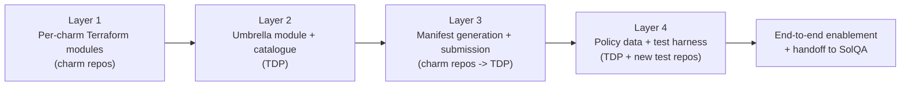

# Implementation tracking for UHPC015

This document is **not normative**. It breaks [UHPC015](uhpc015.md) into a sequenced set of tasks
suitable for tracking as an epic, and may be revised (re-ordered, re-scoped, re-estimated) without
requiring a change to the spec itself. Where this document and UHPC015 disagree, UHPC015 is
authoritative.

## Layer dependency graph

Test-harness work in Layer 4 (the pytest plugin, `charmed-hpc-tests` repo, and test tagging) can
start in parallel with Layer 2/3 once the Layer 1 tag name and Layer 2 product/SKU names are known,
since it does not depend on the umbrella module being complete.

## Task breakdown

### Task 1. Layer 1: per-charm Terraform modules (charm repos)

Repos: `slurm-charms`, `filesystem-charms`, `sssd-operator`, `apptainer-operator`.

1. **Audit existing modules for the `app_name`/`provides`/`requires` contract.** Confirm every
   module in scope exports all three outputs (an empty `requires = {}` is acceptable); add any
   missing output. Confirm `terraform.tf` version constraints are consistent across modules.
2. **Tag a stable ref** (for example `tdp-v1`) on each of the four repos once their modules satisfy
   the contract; record the tag -> commit SHA for each repo.
4. **Check Juju Terraform provider compatibility** on SolQA's self-hosted runners against each
   module's `~> 1.0` pin; record whether `juju_terraform_provider_version` needs to be set at
   dispatch time.
5. **Record per-charm base availability** (which charms have a release for which Ubuntu base) to
   inform Layer 4's `versions.json` defaults.

### Task 2. Layer 2: umbrella module and catalogue integration (TDP)

1. Confirm `mysql-plans` compatibility with the intended umbrella-module settings (router
   disabled, S3/TLS/otel-collector bundling behaviour) before building around it. Separately,
   confirm each in-scope charm's `provides.cos_agent` endpoint is compatible with `grafana-agent`'s
   `cos-agent` relation.
2. Build `catalogue/modules/charmed_hpc/` (`applications.tf`, `variables.tf`, `outputs.tf`,
   `provider.tf`, `integrations.tf`, `README.md`), importing every Layer 1 module at its pinned tag
   plus `mysql-plans` and `grafana-agent`.
3. Design `var.filesystems` as a map keyed by mount point, so `integrations.tf` can `for_each` over
   it to deploy and relate zero, one, or several `filesystem-client` + backend pairs concurrently
   (rather than a single "pick one backend" enable flag).
4. Declare all `juju_integration` resources (always-on control plane + database; gated
   apptainer/identity/observability relations; `for_each`-driven filesystem relations) and the
   health-gate `null_resource`.
5. Wrap the module in `catalogue/units/charmed_hpc/terragrunt.hcl`; decide and document MySQL
   placement (inline vs. dedicated unit).
6. Build `catalogue/composites/charmed_hpc/base/terragrunt.stack.hcl` (model + manual machines +
   `charmed_hpc` unit).
7. Build `catalogue/solutions/charmed_hpc/maas/terragrunt.stack.hcl` (MAAS controller + composite +
   `cos-lite`/`cos` unit, wiring `cos_endpoints`/`cos_urls`/`model_endpoints` into the composite the
   same way `catalogue/solutions/cos-lite/maas/terragrunt.stack.hcl` does for `canonicalk8s`);
   update `catalogue/README.md`.

### Task 3. Layer 3: manifest generation and submission (charm repos -> TDP)

1. Lock the `v0` manifest payload shape for `charmed-hpc` (metadata + `revisions` map) against
   `scripts/policy/manifest.go`.
2. Build the `workflow_dispatch` manifest-generation workflow (Charmhub revision lookup per
   track/risk, payload assembly).
3. Add a CI validation step (`policy validate-manifest`) so a malformed manifest fails before
   submission.
4. Wire submission to TDP's `Submit Release Manifest` workflow, including a dry-run path.

### Task 4. Test harness: pytest plugin and integration-test tagging

1. **Build the shared pytest marker plugin package**, owned by the Charmed HPC team (not the
   individual charm repos), as a small pip-installable package exposing a `pytest11` entry point so
   the marker taxonomy loads automatically:
   - Register the `validation`, `uat`, and `capability(<slug>)` markers in `pytest_configure`,
     mirroring how `slurm-charms` registers its `high_availability` marker today.
   - Maintain a `CAPABILITIES` allowlist of valid slugs, so an unrecognised slug fails collection
     immediately rather than silently producing no scorecard signal.
   - Fail collection (`pytest_collection_modifyitems`) when a test has zero or more than one suite
     marker, or uses a capability slug outside the allowlist.
   - Emit a capability -> test coverage mapping into `metrics.json` after a run.
   - Provide a transitional alias mapping the existing `high_availability` marker to
     `capability("ha")`, so `slurm-charms`' `--run-high-availability` CLI flag keeps working
     unchanged during migration.
2. **Tag every existing integration test** in the four charm repos with exactly one of
   `@pytest.mark.validation` or `@pytest.mark.uat`, and remove each repo's own
   `pytest_configure`/`pytest_collection_modifyitems` in favour of the plugin. Confirm fixtures and
   custom step definitions in each repo's `conftest.py` are unaffected.

### Task 5. Layer 4: scheduling policy and deployment stacks

1. Write `policies/data/products/charmed-hpc.yaml` and the `charmed_hpc` SKU entries in
   `policies/data/skus.yaml`; confirm `mysql` and `cos` each declare their own `validation: true`
   suite.
2. Dry-run `policy plan --product charmed-hpc` at each risk level and confirm zero violations;
   capture the output for the Task 6 handoff.
3. **Build the `charmed-hpc-tests` repo and its `./sqa_tests` entrypoint.** It is the SolQA-facing
   orchestration point and the `repo:` value in `policies/data/products/charmed-hpc.yaml`. It maps a
   suite name to a pytest marker selector and always writes JUnit output:
   `./sqa_tests validation` -> `pytest -m validation --junit-xml=test_results.xml`;
   `./sqa_tests hpc_uats` -> `pytest -m uat --junit-xml=test_results.xml`. This depends on the
   tagging in Task 4, since `./sqa_tests` selects tests by marker.
4. Document the suite-axis/capability-axis split for `charmed-hpc-tests` contributors.
5. Build the on-disk deployment stacks under `deployments/{composites,solutions}/charmed_hpc/` and
   the corresponding `default_versions.hcl`/`env_settings.hcl` entries.

### Task 6. End-to-end enablement and handoff

1. First dispatch of `Deploy Product` for `charmed_hpc` as a solution; capture logs/artifacts.
2. Re-dispatch with `test_parameters` pointing at `charmed-hpc-tests`; confirm both suites run and
   upload `test_results.xml`/`metrics.json`.
3. Confirm Test Observer registers component builds and pending/executed solution executions
   correctly, and that the reconcile state machine (pending = desired - observed; retry on
   `FAILED`) behaves as expected.
4. Update TDP's `README.md` "Available Composites and Solutions" tables and
   `docs/reference/{composites,solutions,substrates}/`; write a runbook for dispatching
   `charmed_hpc` and interpreting results.
5. Review with SolQA; register the `charmed-hpc-tests` repo URL and the new SKUs; capture residual
   follow-ups (including the deferred capability-count promotion gating from UHPC015).
