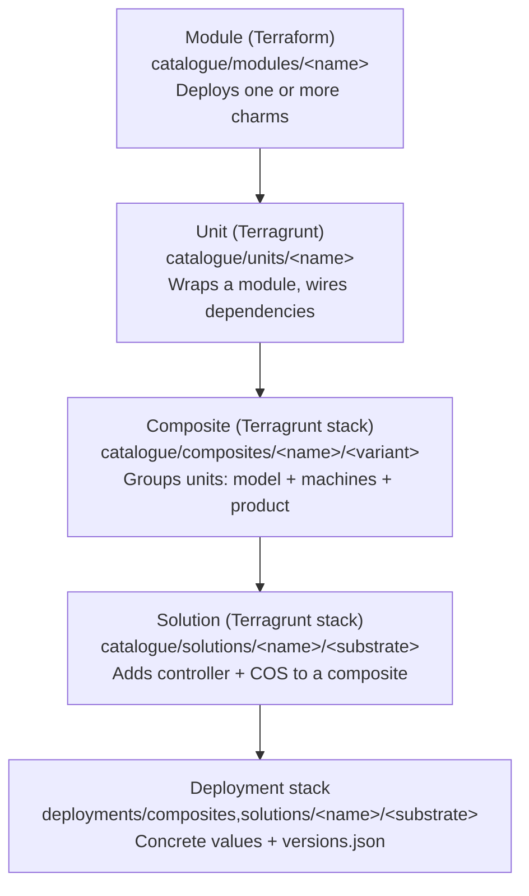
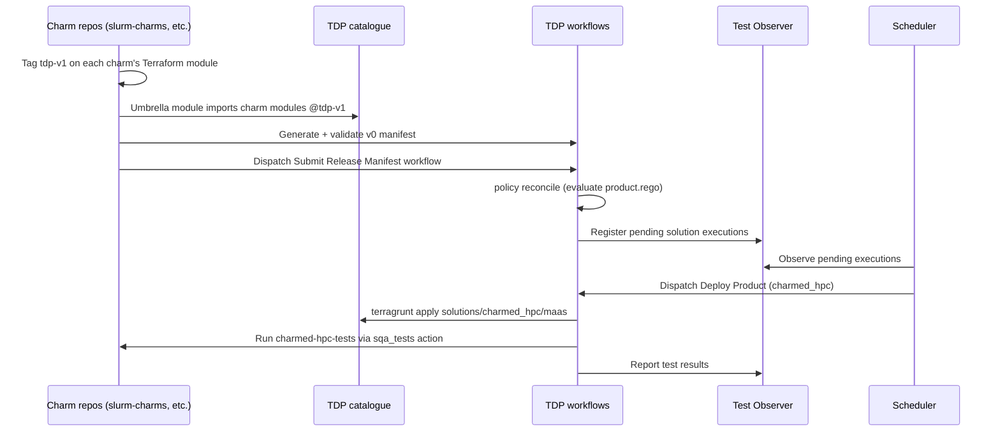

# Charmed HPC integration with the Solutions QA declarative pipeline

## Abstract

This spec describes how Charmed HPC integrates with Solutions QA's (SolQA) declarative testing
pipeline, `terragrunt-deployment-pipelines` ("TDP"). Charmed HPC is the `slurm-charms`,
`filesystem-charms`, `sssd-operator`, and `apptainer-operator` repositories.

It defines the contract each charm repository must expose (a per-charm Terraform module, plus a
single product-wide release manifest), the TDP-side catalogue resources that assemble those
contracts into a deployable `charmed_hpc` product (an umbrella module, unit, composite, and
solution, plus policy data and deployment stacks), and the test harness conventions (a shared
pytest marker plugin and a new `charmed-hpc-tests` repository) that let TDP schedule and run
Charmed HPC's integration tests automatically.

MySQL and observability (COS) are both out of scope for the Charmed HPC repositories themselves:
`charmed_hpc` consumes an existing, externally maintained Terraform module for each. Charmed HPC
only needs to confirm relation compatibility. The umbrella module also supports enabling more than
one filesystem backend at once, so a single deployment can exercise several storage backends side
by side instead of only one.

## Rationale

Charmed HPC needs to integrate into SolQA to continuously improve the product with end-to-end,
product-level testing. Current Charmed HPC testing infrastructure covers individual charms, not the
full stack. SolQA operates TDP to solve this problem for other Canonical products (Canonical Kubernetes,
COS, MicroCeph): TDP reuses shared substrate pools (for example MAAS machines) and drives testing
from a declarative manifest that states which component revisions should be tested together as a
product. For each run it deploys the product under test, runs the suite, and tears the environment
down again. A scheduler reconciles the desired state (from policy data) against the observed state
(in Test Observer) and dispatches only the deployments and test runs still required.

TDP integration enables the whole Slurm cluster stack to be tested together as a single product
against the Product Operational Scorecard. The stack covers `slurmctld`, `slurmd`,
`slurmdbd`, `slurmrestd`, `sackd`, `sssd`, `apptainer`, one or more filesystem backends deployed
concurrently, MySQL, and COS-based observability, including Day-2 operations such as failover and
scale-out, without every charm repository re-provisioning its own infrastructure.

This requires work in two places:

- **Charmed HPC repositories** must expose a stable, machine-consumable contract: a Terraform
  module per charm (so TDP can deploy it), a single product-wide release manifest covering all
  charm revisions (so TDP knows which revisions to test together), and consistently tagged
  integration tests (so TDP's test runner can select a suite).
- **TDP** must gain a new product, `charmed_hpc`, built the same way its existing products are:
  an umbrella Terraform module, wrapped in a Terragrunt unit, grouped into a composite, and
  deployed as a solution, plus the policy data that tells TDP's scheduler what to test and where.

## Specification

### Architecture recap

TDP organizes reusable Terragrunt/Terraform configuration in `catalogue/` as a four-layer
hierarchy, and concrete, dispatchable configuration in `deployments/`:



A release manifest declares the exact component revisions to test as a unit.
Submitting a manifest through the `Submit Release Manifest` workflow validates it, evaluates OPA
policy (`policies/rules/*.rego` against `policies/data/**`) to build a test matrix, and registers
pending solution executions in Test Observer. A scheduler external to this spec then dispatches
TDP's `Deploy Product` workflow for whatever remains pending, and reports results back to Test
Observer.

Charmed HPC integrates with every one of these layers. The remainder of this section defines the
contract at each layer, in the order a reader would build it.

- **Layer 1** is the raw building blocks: each charm exposes a small, self-contained Terraform
  module that deploys exactly that charm and declares its relation endpoints in a standard output
  shape. These modules live in the individual charm repositories.
- **Layer 2** is the glue: an umbrella module imports all the Layer 1 modules, wires relations
  between charms, and gates optional subsystems (storage, identity, observability) behind feature
  flags. It is packaged into a composite (cluster only) and a solution (cluster + Juju controller +
  COS), which are the units TDP actually deploys. This lives in TDP.
- **Layer 3** is the release handoff: a workflow in the charm repositories generates a manifest
  that pins the exact revision of every charm, validates it against TDP's schema, then submits it
  to TDP. TDP evaluates policy against the manifest and registers the pending test runs in Test
  Observer.
- **Layer 4** is the test harness: OPA policy data that maps a manifest to a test matrix, a pytest
  plugin and marker taxonomy that classify individual tests, the `charmed-hpc-tests` entrypoint
  repository that TDP invokes, and the on-disk deployment stacks that make the product
  dispatchable. This lives in TDP.

### Layer 1: Per-charm Terraform modules (charm repositories)

Each charm that participates in the `charmed_hpc` product (`slurmctld`, `slurmd`, `slurmdbd`,
`slurmrestd`, `sackd` from `slurm-charms`; `cephfs-server-proxy`, `nfs-server-proxy`, `lustre-server`,
`lustre-server-proxy`, `filesystem-client` from `filesystem-charms`; `sssd` from `sssd-operator`;
`apptainer` from `apptainer-operator`) must provide a Terraform module at
`charms/<charm>/terraform/` that deploys exactly that charm.

The module must export the same output contract used by every other charm module already in TDP's
catalogue (for example `catalogue/modules/k8s/k8s_charm/` and `.../ceph_csi_charm/`):

- `app_name`: the deployed Juju application's name.
- `provides`: a map of provider-side endpoint names this charm exposes (may be empty).
- `requires`: a map of requirer-side endpoint names this charm consumes (may be empty).

The umbrella module in Layer 2 resolves relations exclusively through these three outputs, so any
charm module missing `requires` (even as an empty map) or exporting a different output shape
cannot be wired into the umbrella module without a change there. Each module's `terraform.tf` must
declare version constraints consistent with the rest of the catalogue's per-charm modules
(`required_version >= 1.0`, `juju/juju ~> 1.0`); the umbrella module is free to require a newer
provider version where a dependency (see below) needs it, without forcing every per-charm module
to move in lockstep.

Every module-defining repository must tag the commit that satisfies this contract with a shared,
stable Git tag (for example `tdp-v1`), so the umbrella module can pin
`source = "github.com/canonical/<repo>//charms/<charm>/terraform?ref=<tag>"` to something
reproducible rather than a moving branch. The tag must be re-cut whenever the module's outputs
change in a way that affects the umbrella module's wiring.

MySQL is out of scope for this layer: `slurmdbd`'s database relation is satisfied by
`canonical/mysql-plans`, an existing Terraform module maintained outside Charmed HPC. Layer 2 only
needs to verify that module's outputs are compatible with `slurmdbd`'s `requires.database`
endpoint.

Observability is out of scope for this layer in the same way: the `cos-agent` relation is
satisfied by `grafana-agent`, a subordinate charm maintained outside Charmed HPC and already
deployed by TDP's existing COS catalogue entries (`catalogue/units/cos`, `catalogue/units/cos-lite`).
Charmed HPC does not need its own Terraform module for it. Any per-charm module whose charm
implements the standard `cos-agent` interface should export a `cos_agent` entry under `provides`
(mirroring `catalogue/modules/k8s/k8s_charm/outputs.tf`'s `provides.cos_agent`), so Layer 2 can
relate it to `grafana-agent` the same way it relates `slurmdbd` to `mysql-plans`.

Not every charm needs to default to the same Ubuntu base. Per-charm module `variables.tf` defaults
should remain whatever base each module's Charmhub track already supports; overriding the base for
a given deployment (for example to test against `ubuntu@26.04` once a charm publishes a matching
track) is a Layer 4 deployment-stack concern (`versions.json`), not a Layer 1 module concern.

TDP's self-hosted runners may carry a Juju Terraform provider version that differs from a
per-charm module's `~> 1.0` pin. TDP already has a mechanism for this that requires no module
changes: the `Deploy Product` workflow's `juju_terraform_provider_version` input causes
`deployments/root.hcl` to `generate` a `versions_override.tf` file that overrides the resolved
provider version at apply time. Charmed HPC only needs to confirm whether an override is required
for its runners and record that decision; it does not need its own override mechanism.

### Layer 2: Umbrella module and catalogue integration (TDP)

TDP gains a new product, `charmed_hpc`, built the same way `canonicalk8s` is built today.

**Module.** `catalogue/modules/charmed_hpc/` imports every Layer 1 charm module at its pinned tag,
plus `mysql-plans` and `grafana-agent`, and exposes one configuration surface for the whole stack.
It follows the same file layout as `catalogue/modules/k8s/`: `applications.tf` (one `module` block
per charm), `variables.tf` (per-charm config objects, enable flags for optional subsystems, machine
placement), `outputs.tf`, `provider.tf`, and an `integrations.tf` that resolves the model name via
`data "juju_model" "this" { uuid = var.model_uuid }` and declares every `juju_integration` between
charms. As with the `k8s` module, always-on relations (Slurm's control plane: `slurmctld` ↔
`slurmd`, `slurmdbd`, `slurmrestd`, `sackd`; and the database relation to MySQL) are declared
unconditionally; optional relations (container runtime via `apptainer`, identity via `sssd`, and
observability via `grafana-agent`'s `cos-agent` relation) are gated behind enable flags so the
module still validates with every flag off.

Storage is deliberately not a single gated relation: `var.filesystems` is a map, keyed by mount
point, of filesystem backend configs, so zero, one, or several `filesystem-client` instances can be
deployed at once via `for_each`, each related to its own backend (one of `cephfs-server-proxy`,
`nfs-server-proxy`, `lustre-server`, `lustre-server-proxy`) and mounted onto the compute fleet. This
lets a single deployment exercise several storage backends side by side (for example CephFS and
Lustre together) rather than only one at a time. A `null_resource` blocks `terragrunt apply` until
the cluster settles, using the same pattern as the `k8s` module's `juju_wait` resource
(`juju wait-for model <name> --query 'forEach(units, unit => unit.workload-status=="active")'`).

Because `slurmctld` alone relates to most of the other charms in the stack, this module is
deliberately one large module rather than several small ones. See
[Evaluated alternatives](#evaluated-alternatives).

**Unit.** `catalogue/units/charmed_hpc/terragrunt.hcl` wraps the module the same way
`catalogue/units/canonical_k8s/terragrunt.hcl` wraps `catalogue/modules/k8s/`: it includes
`root.hcl`, points `terraform.source` at the umbrella module, declares a `dependency "juju_model"`
block (with `mock_outputs` so `terragrunt plan` resolves without a real model), and maps
`values.*` onto the module's variables.

**Composite.** `catalogue/composites/charmed_hpc/base/terragrunt.stack.hcl` groups a
`unit "juju_model"`, a `unit "add_manual_machines"` (for placing controller/login/compute nodes on
manually-provisioned machines), and the `unit "charmed_hpc"` above. This mirrors
`catalogue/composites/canonicalk8s/base/terragrunt.stack.hcl` and is the reusable building block
that a solution, or a SKU that only needs the composite, consumes.

**Solution.** `catalogue/solutions/charmed_hpc/maas/terragrunt.stack.hcl` adds the
infrastructure-level concerns the composite does not own: a `unit "juju_maas_controller"` (reading
MAAS credentials via `run_cmd("maas", "list")`, matching
`catalogue/solutions/cos-lite/maas/terragrunt.stack.hcl`), the `charmed_hpc` composite as a nested
`stack`, and the `cos-lite` (or `cos`) unit and its `cos_model`, matching how
`catalogue/solutions/cos-lite/maas/terragrunt.stack.hcl` deploys `canonicalk8s` alongside COS. The
solution passes the resulting COS SAAS endpoints into the `charmed_hpc` unit's model-endpoint
inputs, reusing the convention `catalogue/units/canonical_k8s/terragrunt.hcl` already exposes
(`cos_endpoints`, `cos_urls`, `model_endpoints`); the umbrella module's `grafana-agent` relation
(declared in Layer 2's module, gated by `enable_cos`) is what actually consumes them, so this
solution needs no bespoke cross-model wiring of its own. `maas_physical` is the primary substrate
target, reusing the existing MAAS setup/cleanup actions and concurrency locking already used by
other products; a second substrate (for example Azure) is out of scope for the initial delivery
unless explicitly requested.

Whether MySQL is deployed inline within `catalogue/modules/charmed_hpc/` (simpler, keeps the
database relation inside one module) or promoted to its own `catalogue/units/mysql/` unit sourcing
`mysql-plans//machines/terraform` is a design decision to make during implementation and record in
the umbrella module's `README.md`; both are consistent with this spec.

`catalogue/README.md` must be updated to list the new module, unit, composite, and solution, and to
describe the integration graph and enable-flag matrix, consistent with how the existing catalogue
entries are documented.

### Layer 3: Release manifest generation and submission (charm repositories → TDP)

A release manifest declares which exact charm revisions should be tested together as the
`charmed_hpc` product. It follows TDP's existing `v0` manifest schema
(`scripts/policy/manifest.go`), with `family` set to `solution` so the payload maps directly onto
`ProductData` (a map of component name to `{ "revision": <int> }`, one entry per charm) with no
fan-out required:


```json
{
  "metadata": {
    "apiVersion": "v0",
    "product": "charmed-hpc",
    "family": "solution",
    "arch": "amd64",
    "base": "ubuntu@26.04",
    "track": "3.6/stable",
    "risk": "candidate",
    "terragruntRef": "tdp-v1"
  },
  "versionsUnderTest": {
    "charmed-hpc": {
      "ref": "tdp-v1",
      "revisions": {
        "slurmctld": { "revision": 0 },
        "slurmd": { "revision": 0 },
        "slurmdbd": { "revision": 0 },
        "slurmrestd": { "revision": 0 },
        "sackd": { "revision": 0 },
        "sssd": { "revision": 0 },
        "apptainer": { "revision": 0 },
        "cephfs-server-proxy": { "revision": 0 },
        "nfs-server-proxy": { "revision": 0 },
        "lustre-server": { "revision": 0 },
        "lustre-server-proxy": { "revision": 0 },
        "filesystem-client": { "revision": 0 }
      }
    }
  }
}
```

> **Placeholder revisions.** The `0`s are placeholders and should be replaced each with the real Charmhub revision before submitting.

The `metadata` block mixes two concerns:

- **Juju-related fields** describe the Juju environment the stack runs on, not Charmed HPC itself:
  `track` is the Juju agent track (for example `3.6/stable`) and must stay consistent with the
  `juju_tracks` declared in the Layer 4 policy data and with the Juju version pinned in
  `deployments/default_versions.hcl`; `base` is the Ubuntu base under test (for example
  `ubuntu@26.04`). These two must not be conflated.
- **Charmed HPC product fields** describe the product being released and tested: `product`
  (`charmed-hpc`), `family` (`solution`), `arch`, `risk` (the TDP test-gating stage, e.g.
  `candidate`), and `terragruntRef` (the TDP ref the deployment stack is pinned to).

A `workflow_dispatch` workflow, living in `slurm-charms` or a small Charmed HPC meta-repository,
generates this manifest: given a `track`/`risk` input, it fetches each charm's current revision
from the Charmhub info API for that channel and assembles the payload above. Before submission,
the generated manifest must be validated locally against TDP's validator
(`go run ./scripts/policy validate-manifest --manifest "<json>"`, run against a checkout of TDP),
so a malformed manifest fails in the Charmed HPC repository rather than after being submitted.

Once validated, the manifest is submitted by dispatching TDP's `Submit Release Manifest` workflow
(`.github/workflows/submit-manifest.yaml`) with the generated JSON. That workflow re-validates the
manifest and runs `policy reconcile --manifest ... --policy-dir policies --deployments-dir
deployments`, which evaluates the Layer 4 policy data to build a test matrix and registers pending
solution executions in Test Observer. The workflow's `dry-run` input allows the payloads to be
inspected without submitting, and this reconciliation only succeeds cleanly once the Layer 4
policy data below exists and evaluates with zero violations.

### Layer 4: Scheduling policy and test harness

**Policy data.** TDP's existing `product.rego` reads two YAML data files per product. The to-be-created `policies/data/products/charmed-hpc.yaml` declares the Juju tracks Charmed HPC
supports, the test suites it exposes, and which SKUs are gated at which risk level:

```yaml
charmed-hpc:
  juju_tracks: ["3.6/stable"]
  test_suites:
    hpc_uats:
      name: hpc-uats
      repo: https://github.com/canonical/charmed-hpc-tests.git
    validation:
      name: validation
      repo: https://github.com/canonical/charmed-hpc-tests.git
      validation: true
  risks:
    beta:
      skus:
        - name: composites/charmed_hpc/maas_physical
          runs: 3
    candidate:
      skus:
        - name: solutions/charmed_hpc/maas_physical
          runs: 1
```

`policies/data/skus.yaml` gains matching entries declaring, per SKU, the full set of products
co-deployed (used only at matrix-generation time, to confirm each co-deployed product, including
`mysql` and `cos`, declares its own `validation: true` suite):

```yaml
skus:
  solutions/charmed_hpc/maas_physical:
    deploys: [mysql, slurmctld, slurmd, slurmdbd, sssd, apptainer, cephfs-server-proxy, lustre-server, cos]
  composites/charmed_hpc/maas_physical:
    deploys: [mysql, slurmctld, slurmd, slurmdbd]
```

`product.rego` enforces, and this data must satisfy: every SKU name referenced exists in
`skus.yaml` and has a matching on-disk deployment stack; `charmed-hpc` declares at least one
non-validation suite (a UAT); every co-deployed product declares its own `validation: true` suite;
and every SKU has at least one Juju track common to all its co-deployed products. These can be
checked locally with `go run ./scripts/policy plan --product charmed-hpc --risk <risk>
--policy-dir policies --deployments-dir deployments`, which must produce `violations == []` at
every risk level Charmed HPC uses.

**Test suite and capability model.** Two independent axes classify tests:

- The **suite axis** (`validation` vs `uat`) selects which tests run for a given dispatch.
  `validation` covers read-only, non-state-changing health and status assertions; `uat` covers
  state-changing acceptance scenarios (failover, scaling, job submission).
- The **capability axis** (a `capability("<slug>")` marker, reporting-only) records which
  operational capabilities a given test exercises. Each capability maps to a row of the Product
  Operational Scorecard. This axis does not affect test selection; it is metadata harvested into
  `metrics.json` for future use. Using capability coverage to gate promotion decisions is
  explicitly deferred; see [Further work](#further-work).

Both markers are provided by a new, small, pip-installable pytest plugin package (owned by the
Charmed HPC team, not the individual charm repositories) so the marker taxonomy is defined once and
loaded automatically via a `pytest11` entry point. The plugin:

- Registers the `validation`, `uat`, and `capability(<slug>)` markers (`pytest_configure`), the
  same way `slurm-charms`' existing `high_availability` marker is registered today.
- Maintains a `CAPABILITIES` allowlist of valid slugs, so an unrecognised slug fails collection
  immediately rather than silently producing no scorecard signal.
- Fails collection (`pytest_collection_modifyitems`) if a test has zero or more than one suite
  marker, or uses a capability slug outside the allowlist.
- Emits a capability → test coverage mapping into `metrics.json` after a run.
- Provides a transitional alias mapping the existing `high_availability` marker to
  `capability("ha")`, so `slurm-charms`' existing `--run-high-availability` CLI flag continues to
  work unchanged during migration.

Charm repositories adopt the plugin by adding it to test dependencies, tagging every existing
integration test with exactly one of `@pytest.mark.validation` or `@pytest.mark.uat`, and removing
their own `pytest_configure`/`pytest_collection_modifyitems` implementations in favour of the
plugin's. Fixtures and custom step definitions in each repository's `conftest.py` are unaffected.

**Test entrypoint.** A new repository, `charmed-hpc-tests`, is the SolQA-facing test entrypoint.
It is the `repo:` value in `policies/data/products/charmed-hpc.yaml` above, and it composes which
charm-repository suites make up the solution-level `hpc_uats` and `validation` runs. It exposes an
executable `./sqa_tests` that maps a suite name to a pytest marker selector and always writes JUnit
output:

- `./sqa_tests validation` → `pytest -m validation --junit-xml=test_results.xml`
- `./sqa_tests hpc_uats` → `pytest -m uat --junit-xml=test_results.xml`

TDP's `sqa_tests` composite action (`.github/actions/common/sqa_tests/action.yaml`) checks out
`{repo}@{ref}/{subdir}` and runs `['./sqa_tests'] + <args>`, where `<args>` comes from the `args`
field of the dispatch's `test_parameters`. It must be a JSON array (for example
`["hpc_uats"]`), because the action reads it with `json.loads(...).get('args', [])` and concatenates
it directly onto a list; it does not pass `args` through `fromJSON()`. Pass/fail is determined by
`./sqa_tests`'s exit code, and `test_results.xml` plus `metrics.json` are uploaded as artifacts.
Capability markers never affect suite selection. They are `metrics.json` metadata only, produced
by the pytest plugin described above.

**Deployment stacks.** For `charmed_hpc` to be dispatchable at all, on-disk deployment stacks must
exist under `deployments/composites/charmed_hpc/<substrate>/` and
`deployments/solutions/charmed_hpc/<substrate>/`, each with a `terragrunt.stack.hcl` sourcing the
matching Layer 2 catalogue composite/solution and a `versions.json` for stack-specific version
overrides. This follows the pattern already used by
`deployments/composites/canonicalk8s_microceph/maas_physical/` and
`deployments/solutions/cos/maas_physical/`. These stacks read shared configuration via
`find_in_parent_folders("default_versions.hcl")` and `find_in_parent_folders("env_settings.hcl")`,
select the active cluster from `get_env("CLUSTER")`, and are what `product.rego`'s SKU-existence
check validates against. `deployments/default_versions.hcl` gains a `charmed_hpc` (or per-charm)
entry with default channels and bases; `deployments/env_settings.hcl` gains per-cluster HPC machine
constraints (controller/login/compute node MAAS tags, cores, memory, root disk), following the
existing per-cluster entries there. Because `Deploy Product` resolves a product purely by directory
path, no workflow code changes are required once these stacks exist.

### End-to-end flow



## Evaluated alternatives

**Splitting the umbrella module into several smaller modules** (for example one per charm, wired
together at the composite level) was considered, since it would mirror the fine-grained Layer 1
modules more closely. It was rejected because `slurmctld` alone relates to most of the other
charms in the stack (`slurmd`, `slurmdbd`, `slurmrestd`, `sackd`, optionally `apptainer` and
`filesystem-client`); declaring those relations across independent modules would require each
module to depend on outputs from several siblings, which Terraform cannot resolve without
introducing circular module dependencies. A single umbrella module that imports all the charm
modules and owns every relation avoids this, at the cost of one larger module instead of many
small ones. This is the same tradeoff TDP already made for its `canonicalk8s` product.

**Inlining MySQL versus a dedicated `mysql` unit** is left as an implementation-time decision (see
[Layer 2](#layer-2--umbrella-module-and-catalogue-integration-tdp)) rather than settled here, since
both are compatible with this spec and the choice mainly affects how cleanly the database relation
composes with a future second solution (for example a non-MAAS substrate).

**Gating each filesystem backend independently versus a single "pick one" enable flag** was also
considered. A single flag is simpler, but it would prevent a single deployment from ever exercising
more than one storage backend, which the Product Operational Scorecard's storage rows need for
interoperability coverage (for example running CephFS and Lustre side by side in the same run). The
`var.filesystems` map costs some extra `for_each` complexity in `integrations.tf` and more
machine/compute headroom per run, but avoids needing N near-duplicate umbrella modules or SKUs, one
per backend.

## Risks

- **Wide blast radius in the umbrella module.** Because `slurmctld`'s relations are centralized in
  one module (see [Evaluated alternatives](#evaluated-alternatives)), a change to any one charm's
  `provides`/`requires` output shape can require a corresponding change to the umbrella module's
  `integrations.tf`, even if the two charms are otherwise unrelated to the change.
- **Misleading inline documentation in TDP's `sqa_tests` action.** The `parameters` input's own
  description example shows `args` as a string (`"args":"--verbose"`), but the action's
  implementation concatenates `args` directly onto a Python list after `json.loads(...)`, which
  requires `args` to be a JSON array. Charmed HPC's dispatch payloads must use the array form
  (`"args":["hpc_uats"]`); this is a pre-existing TDP documentation inconsistency unrelated to this
  integration, and fixing the action's own example is out of scope here.
- **Deferred promotion gating.** Capability coverage is emitted into `metrics.json` now but nothing
  consumes it yet; if the follow-up policy change described below slips, scorecard coverage remains
  informational only, with no automated signal blocking a risk-level promotion on Day-2 operational
  coverage gaps.
- **TDP's existing COS cross-model plumbing is only partially wired up.** `catalogue/modules/k8s/`
  already declares `cos_endpoints`, `cos_urls`, `model_endpoints`, and `grafana_agent_config`
  variables for this purpose, but at least one dependent piece is incomplete today (the `FIXME` in
  `catalogue/units/cos/terragrunt.hcl` notes that a scaled Grafana needs a database offer that isn't
  supported yet, tracked as
  [issue #160](https://github.com/canonical/terragrunt-deployment-pipelines/issues/160)). Charmed
  HPC's `grafana-agent` relation reuses this same convention rather than inventing a new one, so it
  inherits this gap until TDP closes it, independent of anything in this spec.

## Further work

- A scoped follow-up to `policies/rules/common.rego` / `product.rego` to consume the
  capability → test coverage data already being emitted into `metrics.json`, so it can gate
  promotion decisions based on Product Operational Scorecard coverage. This is intentionally not
  part of this spec.
- A second substrate (for example Azure) for the `charmed_hpc` solution, if required beyond the
  initial `maas_physical` target.
- Fixing the `sqa_tests` composite action's inline documentation example so the `args` field's
  described type matches its actual (array) implementation.
- Milestone sequencing and task ownership for implementing this spec are tracked separately in
  [uhpc015-implementation-tracking.md](uhpc015-implementation-tracking.md); that document is not
  normative and may be revised independently of this spec.

## Further information

1. [`terragrunt-deployment-pipelines` repository](https://github.com/canonical/terragrunt-deployment-pipelines)
2. [`terragrunt-deployment-pipelines` catalogue README](https://github.com/canonical/terragrunt-deployment-pipelines/blob/main/catalogue/README.md)
3. [Slurm dynamic nodes documentation](https://slurm.schedmd.com/dynamic_nodes.html) (for context on `slurmd`/`slurmctld` behavior referenced by existing integration tests)
